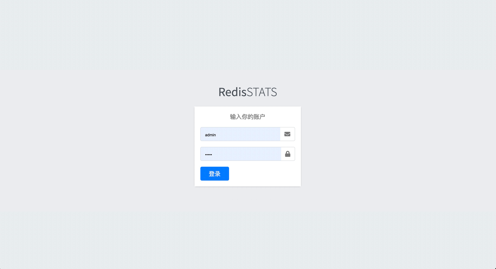
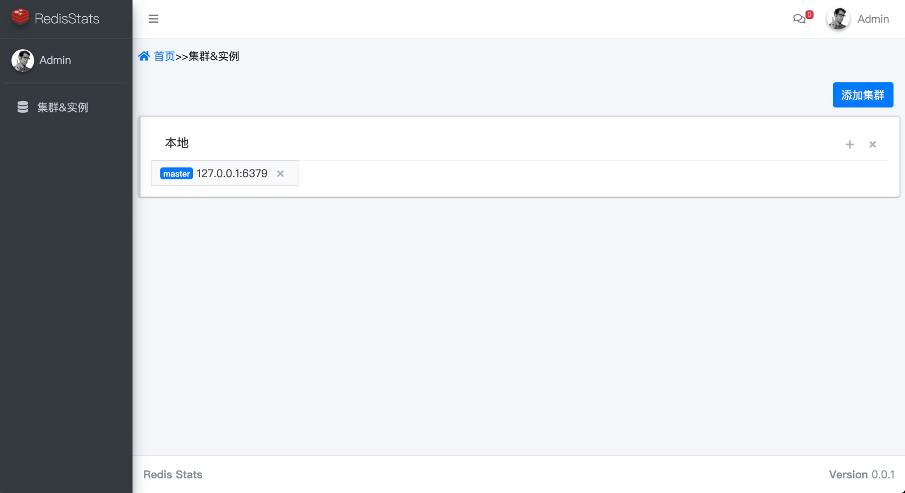
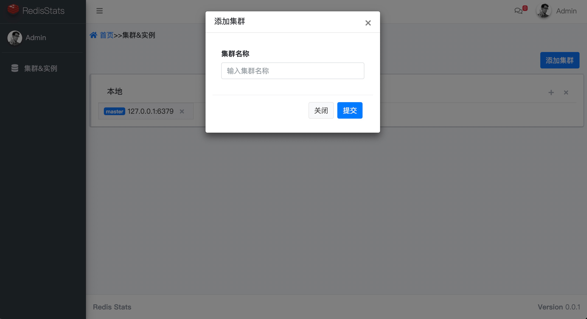
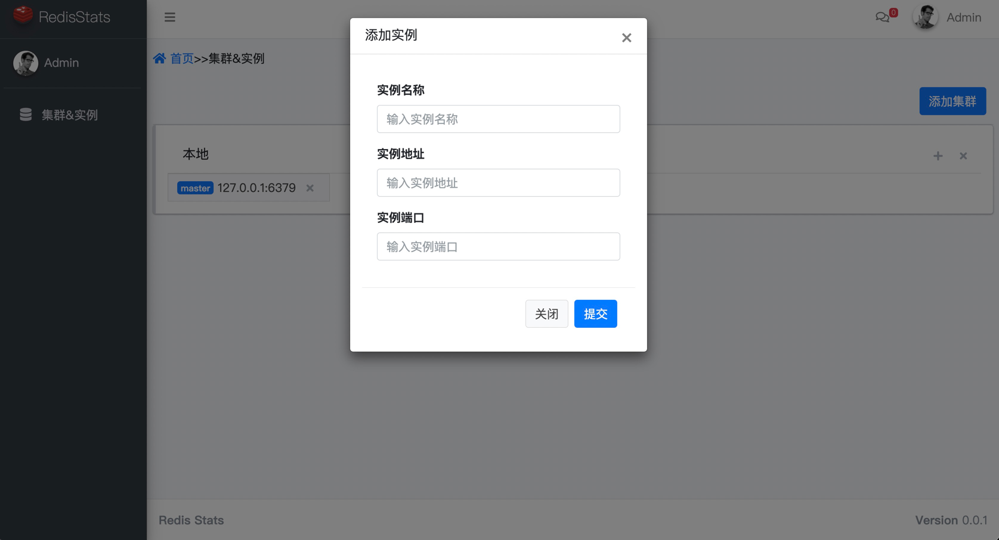
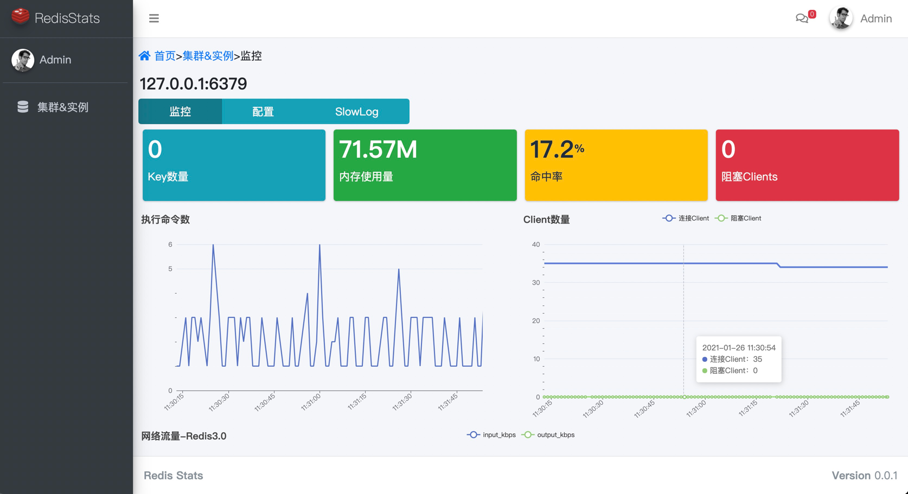
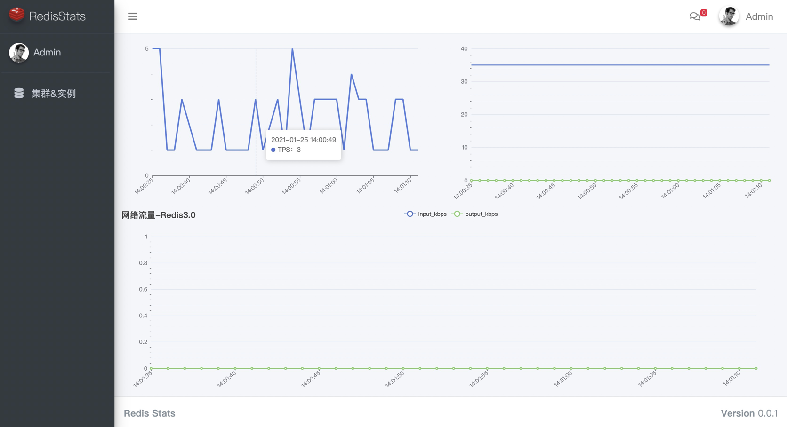
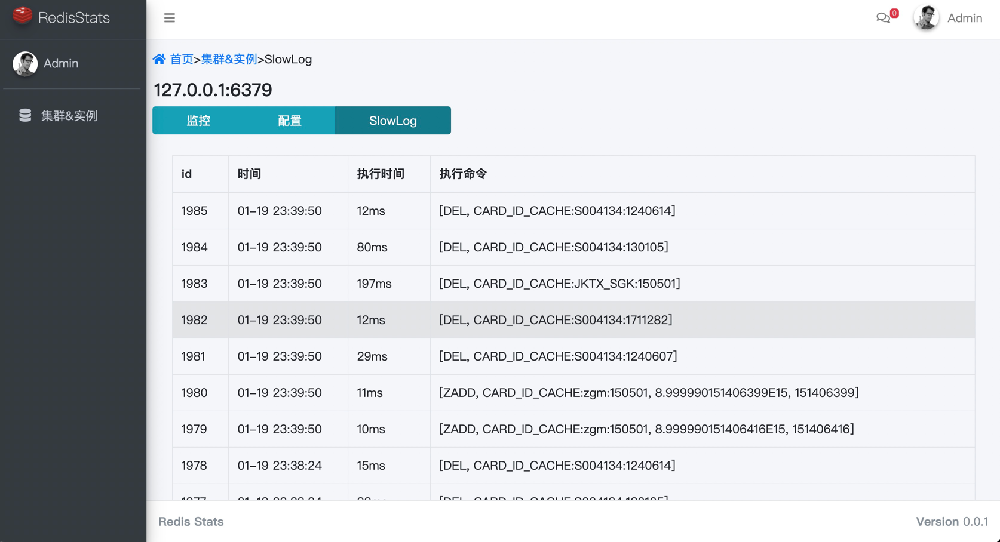
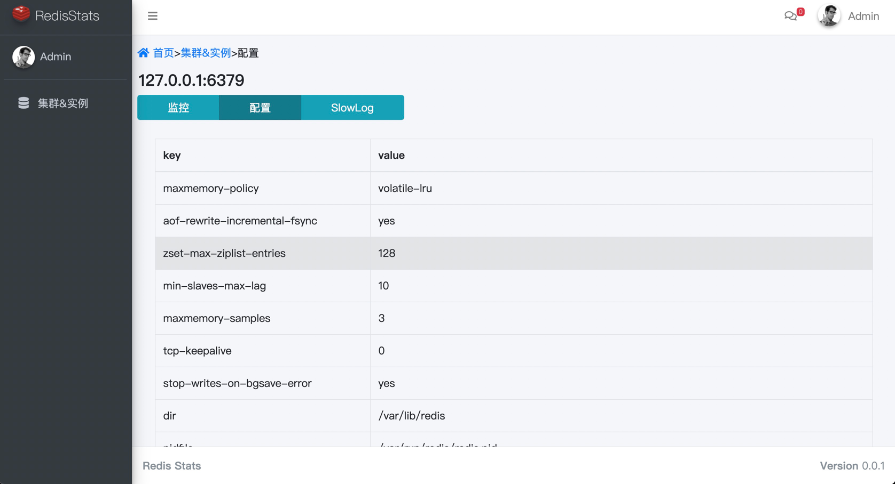

#RedisStats
使用info命令实时生成监控图
+ 支持显示各种复杂集群结构表
+ 支持监控TPS、内存使用量、命中率、阻塞Clients、连接数,网络吞吐量
+ 支持查看redis实例配置
+ 支持查看慢日志
+ 更多功能未完待续 

###使用说明
+ 环境要求：JRE1.8+ 
+ 使用springboot、H2数据库、mybatis、websocket、thymeleaf、tk.mybatis等开源项目
+ H2数据库可自行选择内存或者文件模式 
+ 文件
> spring.datasource.url=jdbc:h2:~/h2/rs-db;FILE_LOCK=NO;
>
> spring.datasource.initialization-mode=embedded
+ 内存
> spring.datasource.url=jdbc:h2:mem:rs-db
> 
+ 默认用户密码
>  username:admin
> 
>  password:admin

####登录

####集群管理

####实例监控

####查看慢日志

####查看配置
